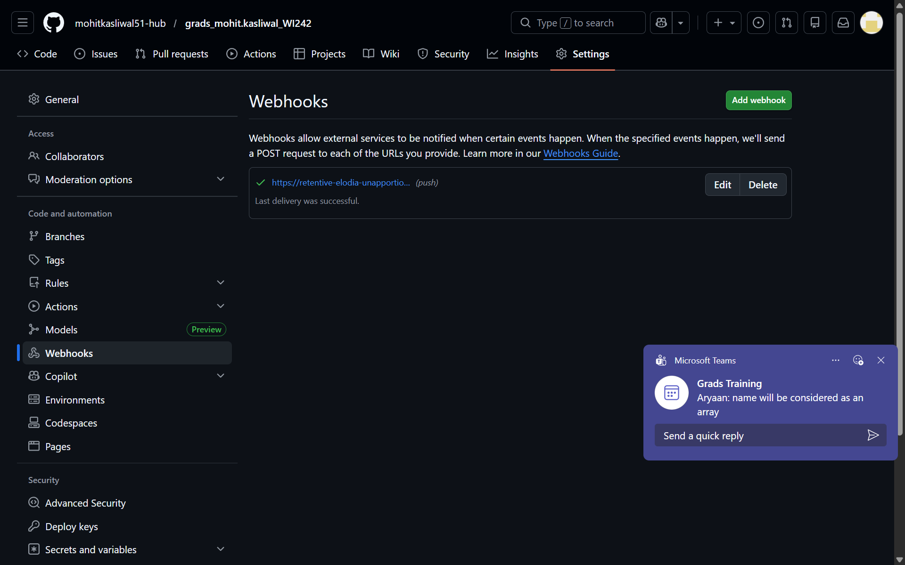
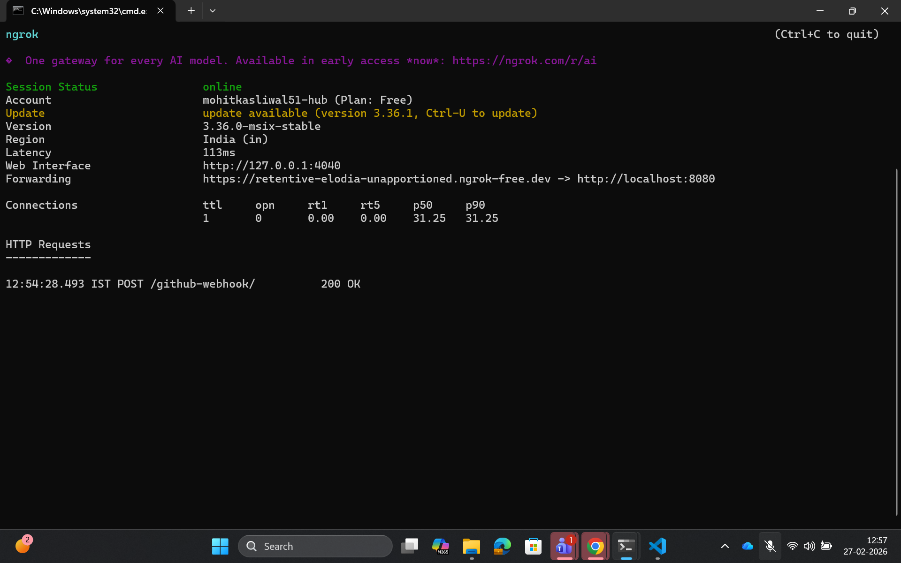
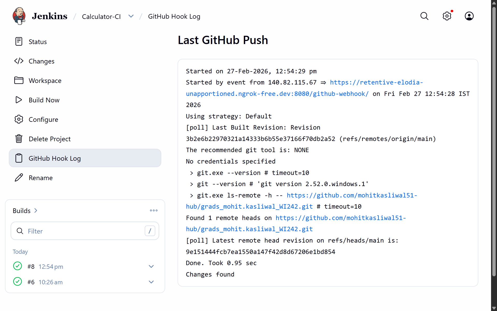
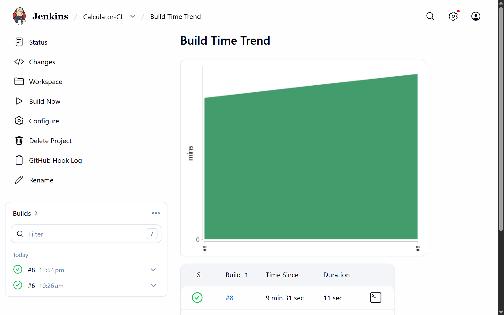
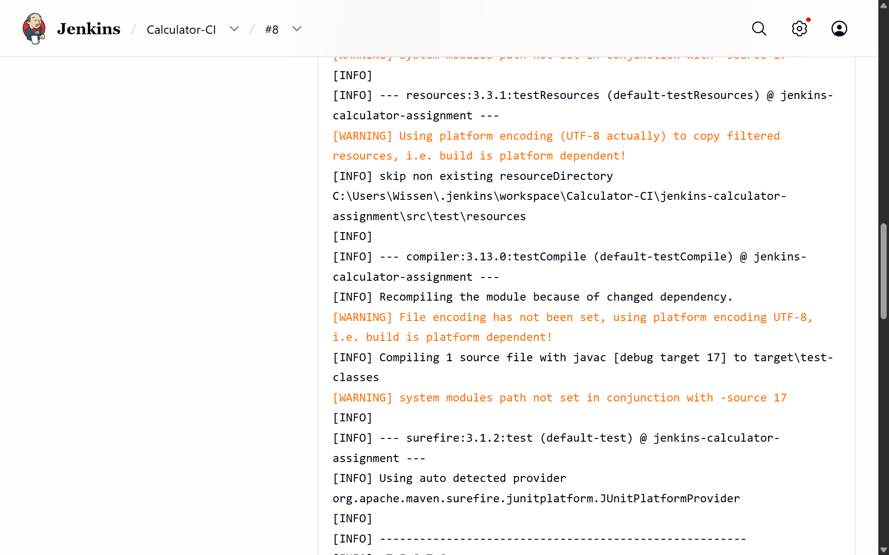

---

# Jenkins CI Setup – Calculator Project

## 1️⃣ Initial Project Setup

---

## 2️⃣ Jenkins Configuration

### 🔹 JDK Configuration

### 🔹 Maven Configuration

### 🔹 SCM Configuration (Calculator-CI)

### 🔹 Build Trigger Configuration

### 🔹 Build Step Configuration

---

## 3️⃣ Successful Build

---

# 🚀 GitHub Webhook Integration

## 🔹 Changed Trigger to GitHub Hook

## 🔹 Configured ngrok

## 🔹 Added Webhook in GitHub

---

## ✅ Webhook Execution Verification

---
